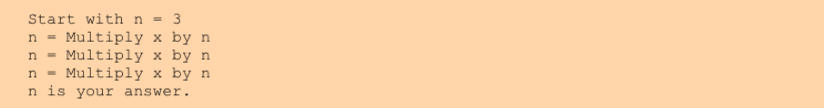
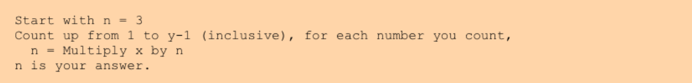
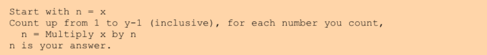
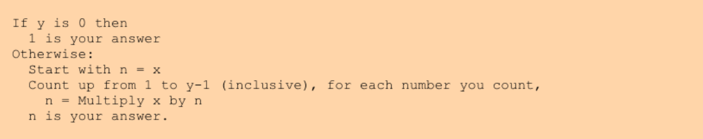
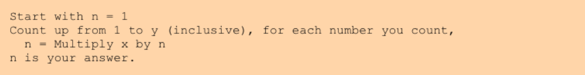
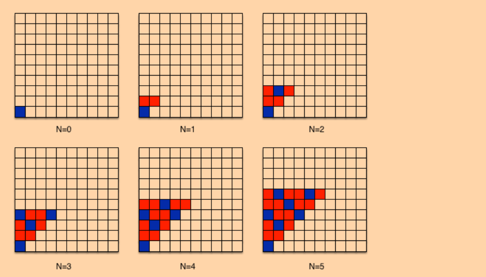
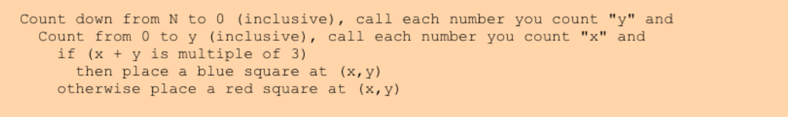

# 第 1 周

## Introduction

该模块介绍了一个用于解决任何编程问题的强大方法——七步法。 

This module introduces a powerful process for solving any programming problem—the Seven Steps. 

你将学习如何系统地处理编程问题，从而制定出具体而正确的算法。  

You will learn how to approach a programming problem methodically, so you can formulate an algorithm that is specific and correct. 

通过示例学习数字序列和图形模式，你将掌握算法开发的技巧。  

You will work through examples with sequences of numbers and graphical patterns to develop the skill of algorithm development.

地址：https://www.coursera.org/learn/programming-fundamentals/home/week/1

## The First Four Steps

### Step 3: Generalize Your Steps

概括步骤的第二种常见方法是寻找重复——相同的步骤反复重复。 

The second common way to generalize steps is to find repetition—the same step repeated over and over.  

通常模式重复的次数取决于参数。  

Often the number of times that the pattern repeats will depend on the parameters.  

我们必须概括出这些步骤要做多少次，以及这些步骤是什么。  

We must generalize how many times to do the steps, as well as what the steps are. 

有时，我们可能会发现有些步骤几乎是重复的，在这种情况下，我们可能需要调整我们的步骤，使它们完全重复。  

Sometimes, we may find steps which are almost repetitive, in which case we may need to adjust our steps to make them exactly repetitive.  

在3^4的例子中，我们的乘法步骤几乎是重复的——都用“某物”乘以x，但“某物”是变化的(3然后9然后27)。  

In our  3^4  example, our multiplication steps are almost repetitive—both multiply  x  by "something," but that "something" changes (3 then 9 then 27).  

更详细地检查这些步骤，我们将看到我们相乘的“某物”是前一步的答案。  

Examining the steps in more detail, we will see that the "something" we multiply is the answer from the previous step. 

 然后，我们可以给它一个名字(和一个初始值)，使所有这些步骤相同:  

We can then give it a name (and an initial value) to  make all of these steps the same:



现在，同样的步骤重复了三次。

 Now, we have the same exact step repeated three times.  

现在我们可以考虑这个步骤作为x和/或y的函数重复了多少次。我们必须小心，不要轻易得出结论，它重复了x次，因为x = 3——在这种情况下，这只是一个巧合。  

We can now contemplate how many times this step repeats as a function of  x  and/or  y.  We must be careful not to jump to the conclusion that it repeats  x  times because  x = 3—that is just a coincidence in this case.  

在这种情况下，它重复y - 1次。  In this case, it repeats  y - 1  times.  

这样做的原因是我们需要把4\*3乘在一起，一开始n中已经有1个了，所以我们还需要y - 1个。  The reason for this is that we need to multiply 4*3s together, and we already have one  in  n  at the start, so we need y - 1 more.  

这将导出以下的一般性步骤:  This would lead to the following generalized steps:



我们需要对参数函数的特定值再做一次推广。 We need to make one more generalization of a specific value to a function of the parameters.  

我们从n = 3开始;  

We start with  n = 3; 

然而，我们并不总是希望从3开始。  

however, we would not always want to start with  3.  

一般情况下，我们想从 n = x 开始:  

In the general case, we would want to start with  n = x:



有时您可能会发现很难看到模式，因此很难概括这些步骤。 

Sometimes you may find it difficult to see the pattern, making it hard to generalize the steps.  

发生这种情况时，返回步骤1和步骤2可能会有所帮助。  

When this happens, returning to Steps 1 and 2 may help. 

对问题进行更多的实例分析将为您提供更多需要考虑的信息，可能会让您深入了解算法的模式。  

Doing more instances of the problem will provide more information for you to consider, possibly giving you insight into the patterns of your algorithm. 

这个过程通常被称为编写“伪代码”，因为你正在以编程方式设计一个没有特定目标语言的算法。

This process is often referred to as writing 'pseudo-code', as you are working to design an algorithm programmatically with no particular target language. 

几乎所有程序员在编写任何实际代码之前都使用这种方法来确保他们的算法是正确的。  Nearly all programmers make use of this method to ensure their algorithm is correct before writing any actual code.

### Step 4: Test Your Algorithm

在第三步之后，我们有了一个我们认为正确的算法。 After Step 3, we have an algorithm that we think is right.  

然而，我们完全有可能在这一过程中搞砸了。  However, it is entirely possible that we have messed up along the way.  

第4步的主要目的是在我们继续之前确保我们的步骤是正确的。  The primary purpose of Step 4 is to ensure our steps are actually right before we proceed.  

为了实现这一点，我们使用不同的参数值来测试我们的算法，而不是我们用来设计算法的参数值。  To accomplish this, we test our algorithm with different values of the parameters than the ones we used to design our algorithm.  

我们手动执行算法，并将得到的答案与正确答案进行比较。  We execute our algorithm by hand and compare the answer it obtains to the right answer. 

如果它们不同，那么我们就知道我们的算法是错误的。  If they differ, then we know our algorithm is wrong.  

我们使用的测试用例(参数值)越多，我们就越有信心我们的算法是正确的。  The more test cases (values of parameters) we use, the more confident we can become that our algorithm is correct. 

不幸的是，不可能通过测试来确保我们的算法是正确的。  Unfortunately, it is impossible to ensure that our algorithm is correct by testing.  

完全确定算法正确的唯一方法是正式证明其正确性(使用数学证明)，这超出了本专业的范围。  The only way to be completely sure that your algorithm is correct is to formally prove its correctness (using a mathematical proof), which is beyond the scope of this specialization.

---

一种常见的错误是步骤3中的错误概括。 

One common type of mistake is mis-generalizing in Step 3.  

正如我们刚才讨论的，有人可能会认为这些步骤重复了x次因为x = 3而这些步骤重复了3次。  

As we just discussed, one might think that the steps repeated  x  times because  x = 3  and the steps repeated 3 times.  

如果我们在步骤3中写下来，我们的算法只会在x = y - 1时起作用;  

If we had written that down in Step 3, our algorithm would only work when  x = y – 1; 

否则我们就会数错次数，得到错误的答案。  

otherwise we would count the wrong number of times and get the wrong answer.  

如果是这种情况，我们希望通过在步骤4中手工测试算法来检测这个问题。  

If that were the case, we would hopefully detect the problem by testing our algorithm by hand in Step 4.  

当我们发现这样的问题时，我们必须回过头来重新检查我们在步骤3中所做的概括。  When we detect such a problem, we must go back and re-examine the generalizations we made in Step 3.  

通常，对于暴露问题的任何测试用例，最好通过返回步骤1和步骤2来完成。  Often, this is best accomplished by returning to Steps 1 and 2 for whatever test case exposed the problem.  

重复步骤1和步骤2会给你一个具体的步骤集合，让你以不同的方式进行概括。  Re-doing Steps 1 and 2 will give you a concrete set of steps to generalize differently. 

然后你就可以发现你之前的概括是错误的，并相应地修改它。  You can then find where the generalization you came up with before is wrong, and revise it accordingly.

---

另一种常见的错误是我们在设计算法时没有考虑到某些情况。 Another common type of mistake is that there are cases we did not consider in designing our algorithm.  

事实上，在我们的x^y例子中，我们没有考虑当y = 0时会发生什么，我们的算法会错误地处理这种情况。  In fact, in our  x^y  example, we did not consider what happens when  y = 0, and our algorithm handles  this case incorrectly. 

如果你在x = 2, y = 0时手动执行算法，你应该得到2^0=1;  If you execute the algorithm by hand with  x = 2,  y = 0, you should get  2^0=1; 

然而，你会得到2的答案。  however, you will get an answer of 2.  

具体来说，您将从n = x = 2开始。  Specifically, you will start with  n = x = 2. 

然后我们将尝试从1数到0 - 1 = - 1，其中没有数字，因此我们将立即完成计数。  We would then try to count up from 1 to  0 – 1 = –1, of which there are no numbers, so we would be done counting right away.  

然后我们会返回n(也就是2)作为答案。  We would then give back  n  (which is  2) as our answer.

---

为了修正我们的算法，对于失败的情况(x = 2, y = 0)，我们将返回并重新访问步骤1和步骤2。这种情况有点棘手，因为我们只知道答案是1而不做任何工作(x^0=1对于任何x)。答案不需要任何工作的事实使步骤2有点不同-我们只给出1的答案。 To fix our algorithm, we would go back and revisit Steps 1 and 2 for the case that failed (x = 2, y = 0).  This case is a bit tricky since we just know that the answer is 1 without doing any work (x^0=1  for any x). The fact that the answer requires no work makes Step 2 a little different—we just give an answer of 1. 

虽然这种简单性看起来很好，但实际上它使得将其合并到我们的一般化步骤中变得更加困难。  While this simplicity may seem nice, it actually makes it a little more difficult to incorporate it into our generalized steps. 

所以我们可能会倾向于这样写一般化的步骤:  We might be tempted to write generalized steps like these:



---

这些步骤显式地检查给出问题(y = 0)的情况，给出该情况的正确答案，然后执行更通用的算法。 These steps check explicitly for the case that gave us a problem (y = 0), give the right answer for that case, then perform the more general algorithm.  

对于某些问题，可能存在需要特别注意的极端情况。  For some problems, there may be corner cases which require this sort of special attention.  

然而，对于这个问题，我们可以做得更好。  However, for this problem, we can do better.  

请注意，如果您无法看到更好的解决方案并采取上述方法，尽管它本身并没有错，但它不是最佳的解决方案。  Note that if you were unable to see the better solution and were to take the above approach, it is not wrong per se, but it is not the best solution.

---

相反，更好的方法是认识到，如果我们无需计数，我们需要一个为1的答案，所以我们应该让n从1开始而不是x。这样做，我们需要多计数1次(计数到 y 而不是 y - 1 )——多乘以一次 x： 

Instead, a better approach would be to realize that if we count no times, we need an answer of 1, so we should start n at 1 instead of at  x.  In doing so, we need to count 1 more time (to  y  instead of to  y – 1)—to multiply by  x  one more time:



---

每当我们在步骤4中检测到算法的问题时，我们通常希望返回步骤1和2以获得更多的信息来进行概括。 Whenever we detect problems with our algorithm in Step 4, we typically want to return to Steps 1 and 2 to get more information to generalize from.  

有时，我们可以马上看到问题(例如，我们犯了一个微不足道的算术错误，或者手工执行有问题的测试用例让我们深入了解正确的概括)。  Sometimes, we may see the problem right away (e.g., if we made a trivial arithmetic mistake, or if executing the problematic test case by hand gives us insight into the correct generalization).  

如果我们看到了如何解决问题，那么不需要重新执行步骤1和2就可以立即解决问题，但是如果遇到问题，则应该重新执行这些步骤，直到找到解决方案。  If we see how to fix the problem, it is fine to fix it right away without redoing Steps 1 and 2, but if you are stuck, you should redo those steps until you find a solution. 

无论您采用何种方法来修复您的算法，您都应该使用您已经使用过的所有测试用例以及一些新的测试用例重新测试它。  Whatever approach you take to fixing your algorithm, you should re-test it with all the test cases you have already used, as well as some new ones.

---

确定好的测试用例是一项重要的技能，可以随着实践而提高。 Determining good test cases is an important skill that improves with practice.  

对于步骤4中的测试，您将希望使用至少产生几个不同答案的用例进行测试(例如，如果您的算法有“是”或“否”的答案，您应该使用同时产生“是”和“否”的参数进行测试)。  For testing in Step 4, you will want to test with cases which at least produce a few different answers (e.g., if your algorithm has a "yes" or "no" answer, you should test with parameters which produce both "yes" and "no").  

您还应该测试任何极端情况——行为可能与更一般的情况不同的情况。  You should also test any corner cases—cases where the behavior may be different from the more general cases.  

无论何时您有条件的决定(包括计数的限制)，您都应该在这些条件的边界附近测试潜在的极端情况。  Whenever you have conditional decisions (including limits on where to count), you should test potential corner cases right around the boundaries of these conditions.  

例如，如果你的算法根据x<3作出决定，For example, if your algorithm makes a decision based on whether or not  x<3，

那么你可能想测试 x = 2, x = 3 和 x = 4。you might want to test with  x = 2,  x = 3, and  x = 4.  

您可以在一定程度上限制您的“纸笔”测试，因为您将在编写完实际代码后对其进行更多的测试。  You can limit your "pencil and paper" testing somewhat, since you will do more testing on the actual code once you have written it.

## Examples

### A Pattern of Squares-阅读1

对于第二个示例，我们将查看在网格上绘制的正方形模式。 For our second example, we will look at a pattern of squares drawn on a grid.  

您可能想知道为什么程序员会对在网格上绘制正方形感兴趣。  You may wonder why a programmer would be interested in drawing squares on a grid.  

除了这个例子可以很好地分析一般的模式之外，计算机图形学最终归结为在2D网格(屏幕)上绘制彩色像素。  Beyond this example serving us well for analyzing patterns in general, computer graphics ultimately boil down to drawing colored pixels on a 2D grid (the screen).   

在这个特殊的例子中，我们有一个算法，它被参数化在一个整数 N 上，并在一个开始都是白色的网格上产生一个红色和蓝色方块的模式。  In this particular example, we have an algorithm that is parameterized over one integer N and produces a pattern of red and blue squares on a grid that starts all white.  

对于N = 0到N = 5，算法输出如下:  The output of the algorithm for N = 0 to N = 5 is as follows:



为了设计算法，我们应该完成步骤 1-4 (就像处理所有问题一样)。 To devise the algorithm, we should work through steps 1–4 (as we should with all problems).   

下一个视频将介绍这些步骤来说明我们是如何想出这个算法的。  The next video walks through these steps to illustrate how we could come up with this algorithm.

---

我们注意到这个问题有许多正确的算法。 We note that there are many correct algorithms for this problem.  

即使我们把自己限制在那些我们自然能想到的选项上(也就是说，通过步骤1-4，而不是尝试一些奇怪的东西)，仍然有许多选项是相同的和正确的。  Even if we restrict ourselves to the ones we can come up with naturally (that is, as a result of working through steps 1–4, rather than trying something bizarre), there are still many choices that are equivalent and correct. 

你处理步骤1的方法会决定你想出何种算法。  Which algorithm you come up with would be determined by how you approach step 1.

---

视频中的算法从左到右，从下到上填充每一列。 The algorithm in the video works from left to right, filling in each column from bottom to top.  

如果我们从上到下、从左到右填充每一行来完成第一个步骤，我们可能会得到以下略有不同的算法:  If we had worked step 1 by working from the top down, filling in each row from left to right, we might have ended up with the following slightly different algorithm instead:



当然，这两种方式也不是唯一的。 Of course, those are not the only two ways.  

您可以从下往上从右到左遍历这些行，并得到一个稍微不同(但也等效)的算法。  You could have worked across the rows from the bottom up going right to left, and come up with a slightly different (but also equivalent) algorithm.  

或者甚至采用完全不同的方法，例如用红色方块填充整个“三角形”，然后再返回填充蓝色方块。  Or even an entirely different approach, such as filling in the entire "triangle" with red squares, then going back to fill in the blue squares.

---

我们强调这一点，因为理解编程问题总是有不止一个正确答案对您来说很重要。 We emphasize this point because it is important for you to understand that there is always more than one right answer to a programming problem.  

你可能会研究一个问题，并提出一个正确的解决方案，但发现它看起来完全不同于其他一些你知道是正确的解决方案(例如，书中的一些问题提供的解决方案，或者老师的考试解决方案)。  You might work a problem and come up with a correct solution but find that it looks completely different from some other solution you know to be correct (e.g., the ones provided for some of the problems in this book, or a teacher's solutions to an exam).  

了解这种可能性很重要，这样你就不会因为看到了不同的正确答案而错误地认为正确答案是错误的。  Understanding this possibility is important so that you will not incorrectly think that a right answer is wrong because you have seen a different right answer.  

这种经历不仅令人沮丧，而且会阻碍你的学习。  Not only is that experience frustrating, but it hinders your learning.

### A Pattern of Squares-视频1

在本视频中，我们将为网格上蓝色和红色方格的特定模式开发一种算法。 In this video, we will develop an algorithm for a particular pattern of blue and red squares on a grid. 

我们从第一步开始，解决这个问题的一个实例。  We're going to start with step one, doing an instance of the problem. 

在这个例子中，我选择 N = 3。  And in this instance, I picked N equals three. 

所以我要做的第一件事就是手算这个问题而不去想我到底在做什么。  So the first thing I'm going to do is work the problem by hand without really thinking through exactly what I'm doing. 

也就是说，我要把它做对，但我不打算把我做的写下来。  That is, I'm going to do it right, but I'm not going to try to write down what I did. 

一旦我完成了这些，我将进行第二步，我将一步一步地写下我所做的事情。  Once I've done that, I'm going to do step two where I write down exactly what I did in a step-by-step fashion. 

我做的第一件事是在 (0,0) 处画一个蓝色方块。  The first thing I did was put a blue square at zero, zero. 

然后我把一个红色方块放在 (0,1)，另一个红色方块放在 (0,2)，一个蓝色方块放在 (0,3)，一个红色方块放在 (1,1)，蓝色方块放在 (1,2)，红色方块在 1,3，红色方块在 2,2，红色方块在 2,3，最后一个蓝色方块放在 (3,3)。  Then I put a red square at zero, one, another red square at zero, two, a blue square at zero, three, a red square at one, one, blue at one, two, red at one, three, red at two, two, red at two, three, and finally a blue at three, three. 

现在我想概括一下以上的步骤，这是编程过程的第三步。  Now I'd like to generalize these steps, step three of the programming process. 

如果我们观察一下以上步骤，可以看到有一些重复和计数的行为，这将帮助我们将这些步骤推广到一个算法中。  And if we look at the steps, we can see there's some repetition and counting behavior, which is going to help us generalize these steps into an algorithm. 

上述步骤的前四步都有 x = 0，紧接着的后三步是 x=1，然后是 x=2 的两步，最后是 x = 3 时的一步。  These first four steps have x equals zero, then we have a group of three steps for x equals one, a group of two steps for x equals two, and finally a single step for x equals three. 

所以当 x 从 0 到 3 的时候我们在重复一些类似的步骤。  So we're repeating somewhat similar steps as we count x going from zero to three. 

但我们具体做什么各不相同。  But exactly what we do varies. 

我们用蓝色，红色，红色，蓝色表示 x = 0 或者用红色，蓝色，红色表示 x = 1，所以我们还需要弄清楚颜色图案。  We color the squares blue, red, red, blue for x equals zero or red, blue, red for x equals one, so the color pattern is something we still have to figure out. 

同样，每个点的 y 坐标的步长是不同的。  Also, how many steps in the y coordinate of each varies. 

我们先看一下 y 坐标，一会儿再回到颜色上。  Let's look at the y coordinates first, coming back to the colors in a minute. 

如果我们看一下第一组步骤，我们看到 y 坐标从 0 到 3 。  If we look at this first group of steps, we see that the y coordinates go from zero to three. 

如果我们看第二组步骤，我们看到y坐标从1到3，在第三组中，从2到3。  If we look at the second group of steps, we see that the y coordinates go from one to three, and in this third group, two to three. 

一般来说，我们从 x 数到3。  So it looks like, in general, we're counting from x to three. 

如果我们暂时忽略颜色，我们可以取这组步骤，我们从 0 数到 3，称我们计数的数为 y，然后在 (0, y) 处放置一个某种颜色的正方形（稍后会弄清楚具体要填什么颜色），我们可以为其他每组书写类似的步骤。  If we ignore the colors for a moment, we can take this group of steps and say, we count from zero to three, calling the number that we count y, then put a square of some color we'll figure out later at zero, y. And we can write similar steps for each of these other groups. 

现在我们可以使用在这些步骤中的模式来进一步推广我们的算法。  And now we can use patterns in these steps to generalize our algorithm further. 

除了以粗体显示的 x 坐标外，每组步骤都是相同的，并且这些步骤以一种漂亮的计数模式变化。  Each set of steps is the same except for the x coordinate shown in bold, and these vary in a nice counting pattern. 

也就是说，我们可以说，从0数到3，称每个数为x，对于每一个数，我们从x数到3，称它为y，我们在x, y处画一些颜色的方块，但这只对N = 3成立。  That is, we can say count from zero to three, call each number that we count x, and for each of those numbers, we'll count from x to three and call that y, and we'll put some color square at x, y. But this is only true for N equals three. 

我们还没有完成推广的一个线索是，这些步骤完全不依赖于N。  A clue that we have not finished generalizing is that the steps do not depend on N at all. 

我们知道对于不同的N，模式是不同的，但这并没有反映在我们写的算法中。  We know that the pattern will be different for different N, but this is not reflected in the algorithm we wrote. 

我们需要让它更通用。  We need to make it more general. 

我们怎么能做到呢?  How could we do this? 

我们可能会意识到，但如果我们没有意识到，我们可以回过头来重复步骤一和步骤二。  We might just realize it, but if we don't, we can go back and repeat steps one and two. 

如果模式很难弄清楚，我们可能需要多次执行步骤一和步骤二。  If the pattern is hard to figure out, we may have to do steps one and two many times. 

举个例子，如果我们回过头来，在N = 1的情况下执行第一步，我们最终会得到这个模式。  So for example, if we went back and performed step one for N equals one, we end up with this pattern. 

当我们做第二步的时候，我们把这些步骤写下来。  And when we do step two, we write down these steps. 

如果我们再看一遍概括过程，我们会发现我们得出了这些步骤。  If we go through the generalization process again, we see that we come up with these steps. 

从0数到1，记作x;  Count from zero to one, call it x; 

从x数到1，记作y;  count from x to one, call it y; 

然后在 (x, y) 处画一个颜色的正方形，这和 N = 3 很相似，只是这个数字变了。  then put a square of some color at x, y, which is very similar to N equals three except this number has changed. 

对于任意 N ，我们根据例子中的模式从 0 数到 N 。  For any N, we count from zero to N based on the pattern from our examples. 

现在我们有一个更一般化的算法。  Now we have a more generalized algorithm. 

当然，我们还需要弄清楚某坐标具体该填什么颜色。  Of course, we need to figure out what the question marks are for the colors.

 要做到这一点，我们可以回到 N = 3 的例子中，并查看相应坐标的方块颜色。  To do that, we can go back to the colors from our N equals three example. 

我们有很多红色的方块和一些蓝色的方块，所以我们应该找出方块是蓝色的规律。  We had mostly red squares with some blue squares, so we should figure out the pattern for when a square is blue. 

我把红色的都扔掉了这样我们就可以看蓝色的了。  I've thrown away the red ones so we can just look at blue for a pattern. 

如果只有4条信息，这个模式可能有点难以理解。  This pattern may be a bit subtle to see with only four pieces of information. 

你可能已经弄明白了，但如果没有，你能做什么呢?  You may have figured it out, but if not, what could you do? 

嗯，有更多的信息可能会更容易看到。  Well, it might be easier to see with more information. 

当N = 5时，我们有更多的蓝色方块需要考虑。  Looking at N equals five, we have more blue squares to consider. 

现在，你看看这个模式，看看你想出了什么，这主要是你看数字和发现模式的能力。  Now, you look at the pattern and see what you come up with, and this is mostly your ability to look at numbers and find patterns. 

如果我们把x和y坐标加在一起，我们看到它们是0,3,3,6,6,6和9。  If we add the x and y coordinates together, we see that they are zero, three, three, six, six, six, and nine. 

这里的模式是，我们画一个蓝色的正方形当且仅当 x + y 是 3 的倍数。  So the pattern here, is we draw a blue square if and only if x plus y is a multiple of three. 

现在我们可以回到我们的算法并指定如果x + y是3的倍数，我们在x, y处画一个蓝色的正方形，否则，我们在x, y处画一个红色的正方形，这个算法看起来很好，但是我们要做第四步并测试它，在下一个视频中会展示。  Now we can go back to our algorithm and specify if x plus y is a multiple of three, we put a blue square at x, y. Otherwise, we put a red square at x, y. This algorithm looks pretty good, but we will want to do step four and test it, as shown in the next video.

### Testing a Pattern of Squares

在本视频中，我们将在网格上的蓝色和红色方块模式中测试算法。 In this video, we will test the algorithm for a pattern of blue and red squares on a grid. 

请记住，测试将使我们对我们的算法更有信心，因为泛化是编程过程中较困难的部分之一，并且容易出现错误，例如留下一些应该是变量的常量。  Remember that testing is going to make us more confident in our algorithm, since generalizing is one of the harder parts of the programming process and is prone to errors such as leaving something constant that should be a variable. 

我们需要一个网格来绘制，一个箭头来跟踪我们在算法中的位置，一个方框来列出我们的变量。  We need a grid to draw on, an arrow to keep track of where in the algorithm we are, and a box to list our variables in. 

我们用2来表示n的值，我们为x做一个盒子，从0开始计数。  Let's use two for our value of N. We make a box for x and start counting at zero. 

然后我们为y做一个方框，开始计算x的值，这里是0。  Then we make a box for y and start counting at x's value which is zero here. 

现在，我们需要判断x + y是否是3的倍数。  Now, we need to decide if x plus y is a multiple of three. 

是的，所以我们进入if语句，在(0,0)处放一个蓝色方块。  It is, so we go inside the if statement and put a blue square at zero, zero. 

现在，y的迭代没有更多的步骤了，所以我们继续计数，直到y等于1。  Now, there are no more steps for this iteration of y, so we continue counting with y equals one. 

0 + 1不是3的倍数，所以我们输入else子句在(0,1)处画一个红色方块。  Zero plus one is not a multiple of three, so we enter the otherwise clause and put a red square at zero, one. 

这个y没有更多的步骤了，所以我们来计算下一个。  There are no more steps for this y, so we'll count the next one. 0 + 2不是3的倍数，所以我们在(0,2)处画一个红色方块。  Zero plus two is not a multiple of three, so we'll put a red square at zero, two. 

继续数，y等于3。  We continue counting, and y is three. 

但是我们只从x数到N所以我们不做这些步骤。  But we were only counting from x to N so we don't do any of these steps. 

继续数x，现在x等于1。  And we continue counting for x, so now, x is one. 

我们从1数到N，称它为y, 1加1不是3的倍数，所以我们在(1,1)处画一个红色方块。  We're going to count from one to N and call that y. One plus one is not a multiple of three, so we put a red square at one, one. 

y递增，1 + 2是3的倍数，所以我们在(1,2)处画一个蓝色的正方形。  Incrementing y, one plus two is a multiple of three, so we put a blue square at one, two. 

我们数完了y，接下来，我们数下一个x，从2数到2,2加2不是3的倍数，所以我们画一个红色的方块。  We're done counting for y, so next, we count our next x. Counting from two to two, two plus two is not a multiple of three, so we put a red square. 

我们已经数完了y，所以我们要数下一个x，我们已经数完了x，因为我们只想数到N，也就是2。  We finished counting for y, so we count for the next x. We're done counting for x since we only want to count to N which is two. 

我们完成了计数，完成了算法的执行。  So we're done with the counting, and we finished executing this algorithm. 

做完了，我们找到了期望的答案。  We are done, and we found the answer we expect. 

我们可以说，我们的算法，至少对N = 2有效。  We can say our algorithm, at least, works for N equals 2. 

我们对我们的算法更有信心了因为我们已经证明了它对至少一个N值是正确的而不是我们以前提出的。  We're a little bit more confident in our algorithm because we've shown it to be correct for at least one value of N that was not what we used to come up with it. 

如果我们想要更有信心，我们就必须更彻底地测试它。  If we wanted to be more confident, we would have to test it more thoroughly. 

一如既往，测试不能证明它是正确的，它只能使我们越来越有信心。  As always, testing can't prove that it's correct, it can only make us more and more confident.

### Drawing a Rectangle

在这个视频中，我们将逐步介绍在下面这个问题中设计算法的过程。 In this video, we're going to step through the process of designing an algorithm in the context of the following problem. 这里我们有一个16x16的网格，我们想画一个蓝色的矩形，它的高度和宽度都是特定的，位于特定的起始点(x, y)上。  Here we have a 16x16 grid and we're interested in drawing a blue rectangle of particular height and width located at a particular starting x, y location. 首先，我们来看这个问题的一个具体例子。  So to begin with, we'll just look at a specific instance of this problem. 假设起始点的x和y坐标是(7,9)  Let's suppose that the starting point should have the x and y coordinates (7,9). 矩形的宽度应为8，矩形的高度应为4。  The width of the rectangle should be 8 and the height of the rectangle should be 4. 现在，为了做这个问题的一个例子，我们要看我们的起点，简单地画出这个矩形。  Now, to do an instance of the problem, we're going to look at our starting point and simply draw that rectangle. 你可以假设你有一支蓝色的笔你要把这个矩形画出来。  You can assume that you have some kind of a blue pen and you are just going to draw this rectangle as the problem specified.

---

现在我们需要退一步，写下我们刚刚做了什么。 Now we need to take a step back and write down what we just did.

---

我们做的第一件事是从(7,9)点开始画一条长度为8的水平线。 The first thing that we did was start at point (7,9) and draw a horizontal line the length of 8. 接下来，我们画另一条长度为8的水平线，从(7,10)开始。  Next, we draw another horizontal line of length 8 starting at (7,10). 第三条水平线，起点高一点。  A third horizontal line that starts one point higher. 最后，第四条水平线从(7,12)开始。  And finally, a fourth horizontal line starting at (7,12). 让我们离开这张图，看看我们写出来的，描述我们所做的事情的实际线条。  Let's step away from the drawing and look at the actual lines we've written out, describing what we did.

---

你会注意到这是一个非常重复的过程。 You'll notice that this is a very repetitive process. 这四个步骤中唯一的区别是y坐标。  The only difference in these four steps is the y coordinate. y坐标从9开始到12结束。  The y coordinate starts at 9 and stops at 12. 我们从9开始的原因是因为这是矩形的起始y坐标。  The reason that we start at 9 is because that's the starting y coordinate of our rectangle. 我们停在12的原因是因为我们想画一个高为4的矩形。  The reason we stop at 12 is because we're interested in drawing a rectangle but has height 4. 我们要画四条水平线，止于y +高度- 1。  So, we're going to draw four horizontal lines stopping at y + height- 1.

---

Now, that we've inspected these four steps,

---

let's try to write an algorithm that will generalize them.

---

Recall that we were counting up from y to the value y + height. 

Now, this was actually an exclusive y + height, because we counted 9, 10, 11, 12. 

We did not actually go all the way up to 13, which is y+height. 

We're going to call this number i, and then for each of those values, we're going 

to draw a horizontal line of length 8, starting at the coordinate (7,i). 

Why are we drawing a line of length 8? 

That's because it's the width of the rectangle. 

So we can go ahead and call this width.

---

This way, we will be able to use our algorithm for 

rectangles of different sizes. 

And why are we starting at the x location 7? 

Because that's our beginning x coordinate.

---

So we can call that x.

---

This way our algorithm will accommodate all values of x. 

Now this part seems a little bit complicated. 

We're going to draw a horizontal line of length width, starting at (x,i). 

It's actually fine for this step to seem a little bit complicated. 

We'll just call that a different programming problem. 

We're going to assume that we either already know how to 

draw a horizontal line of length width starting at (x, i). 

Or we can solve this as its own programming problem, 

beginning with steps 1 through 4 all over again. 

For this exercise we're just going to assume we know how to perform this step.

---

The last thing we want to do,is add a little bit more precision 

because we wanted the line to be blue. 

So our algorithm needs to specifically say that we are drawing a blue line of length 

width, starting at the location (x,i). 

Test this algorithm for yourself. 

Give yourself a value of x, y, a width and 

a height that you want to test out and see whether this works for you. 

As a final note, some values of x, y, width and 

height will cause you to draw off the grid. 

In this case we're going to assume that nothing special happens and 

that doing nothing in response to this, is the desired behavior. 

Later on we'll look at ways of handling errors and 

corner cases in a more sophisticated manner.

---


### Closet Point

在这个视频中，我们要解决的问题是在一组点中找出离另一个给定点最近的点。 In this video, we're going to work the problem of finding the closest point out of a set of points to some other given point. 

我们先自己做一个例子。  We'll start by doing an instance of this problem by ourselves. 

为了做到这一点，我首先画了一个笛卡尔坐标网格并选择了S个点，你可以在这里看到，另一个点P，它是1，- 1。  To do that, I've begun by drawing a Cartesian coordinate grid and choosing a set S of points, which you can see here, another point P, which is one, negative one. 

我们要在S中找到离p最近的点，我要做的第一件事是在笛卡尔平面上画出点。  We're going to find the point in S that is closest to P. The first thing I'm going to do is to draw my points on my Cartesian plane. 

现在，我可以开始解决这个问题了。  Now, I can begin working through this. 首先，我需要一些领域知识。  First, I need some domain knowledge. 

我需要两点间距离的数学定义，如果你不记得了，就是x值差的平方加上y值差的平方然后取它的平方根。  I need the mathematical definition of the distance between two points, which if you don't remember, is the difference in the x values squared plus the difference in the y values squared and then we take the square root of that. 

我要做的就是计算P和(2,7)之间的距离，得到的结果是8.06。  So the way that I would do this is calculate the distance between P and two, seven, and I would come up with 8.06. 

然后，我计算P和10,5之间的距离，得到10.82。  Then, I would compute the distance between P and 10, 5 and come up with 10.82. 第一个点更近，所以我保留它。  The first point was closer, so I'm going to keep that. 

这个点的距离是7.07，所以我要保留最近的新点。  This point is 7.07 away, so I'm going to keep the new closest point so far. 这个点距离是7.81，所以(8，- 2)更近。  This point is 7.81 away, so eight, negative two is still closer. 这个点的距离是5.66，所以我们有了一个新的最近点。  This point is 5.66 away, so we have a new closest point. 这一点距离是9.06，所以- 3 - 5更近。  This point is 9.06 away, so negative three, negative five is closer. 这个点距离是9.22，所以- 3 - 5更近。  This point is 9.22 away, so negative three, negative five is still closer. 没有更多的点需要测试，所以- 3 - 5是我的答案哪个点最接近1，- 1。  And there are no more points to test, so negative three, negative five is my answer to which point is closest to one, negative one. 如果我们从视觉上检查这张图，这似乎是很合理的。  If we visually inspect this picture, that seems pretty reasonable. 它看起来是最近的。  It looks like the closest. 现在，我把刚刚做的写下来。  Now, I write down exactly what I just did. 我计算了1的平方加上8的平方，取平方根，得到8.06。  I computed one squared plus eight squared, took the square root and got about 8.06. 我计算了9的平方加6的平方的平方根，得到10.82，我把10.82和8.06比较，发现8.06更小。  I computed the square root of nine squared plus six squared and got 10.82, and I compared 10.82 to 8.06 and said 8.06 is smaller. 我计算了7的平方加上- 1的平方的平方根，得到7.07，我把7.07和8.06比较了一下，7.07更小，所以这个是更好的选择。  I computed the square root of seven squared plus negative one squared and got 7.07, and I compared 7.07 to 8.06 and said 7.07 is smaller, so this is a better choice. 然后我比较了6的平方加上- 5的平方的平方根，得到7.81。  Then I compared the square root of six squared plus negative five squared and got 7.81. 我比较了7.81和7.07，得到7.07更小，以此类推。  I compared 7.81 with 7.07 and got that 7.07 was smaller and so on and so on and so on. 最后，我给出的答案是- 3，- 5。  And then when I got to the end, I gave my answer as negative three, negative five. 这些步骤看起来很合理，但实际上我们忽略了在写这些步骤的过程中所做的一些事情。  These seem like reasonable steps, but we actually glossed over something that we did in the process of writing these steps down. 仔细地把步骤写下来是很重要的因为如果我们遗漏了步骤，我们在一般化的时候就会遗漏它们，最后就会出问题。  It is very important that we write our steps down carefully because if we're missing steps, we're going to miss them when we go to generalize and end up having a problem. 这里有一个重要的线索。  Here's an important clue. 看看这一步我们给出的答案是- 3 - 5。  Look at this step where we give an answer of negative three, negative five. 当我们进行归纳的时候，我们会问，“为什么我们要用- 3 - 5 ?”  When we go to generalize, we're going to ask, "Why did we use negative three, negative five?" 然后我们会注意到我们没有在其他地方看到- 3和- 5。  Then we're going to notice we don't see negative three, negative five anywhere else. 我们的答案似乎不知从哪里冒出来，这表明我们遗漏了一些东西。  The fact that our answer seemingly comes out of nowhere indicates that we're missing something. 我们做了一些没有有意识地思考和写下来的步骤，我们需要在继续之前解决这个问题。  We did some step without consciously thinking about it and writing it down, and we need to fix that before we go on. 我们现在可能会注意到这一点，当我们进行泛化时，我们可能会注意到这一点，在这种情况下，我们需要回过头来修正它。  We may notice this now, we may notice it when we go to generalize, in which case we need to come back and fix it. 为什么我们选- 3 - 5作为答案呢?  Why was it that we picked negative three, negative five as our answer here? 回顾我们最后的步骤，最后剩下的长度为5.66的虚线是我们一直在跟踪的，到目前为止我们最好的选择。  Reviewing our last steps, the last remaining dotted line of length 5.66 is what we were keeping track of, our best choice so far. 从点(2,7)开始，然后转一圈每次找到更短的距离就更新一次。  We started at point two, seven, then we went around and updated it each time we found a shorter distance. 然而，当我们写我们的步骤时，我们从来没有提到过到目前为止距离最短的点。  However, as we wrote our steps, we never mentioned the point that went with the shortest distance so far. 我们应该回过头来修改我们的步骤，把它包括进来。  We should go back and fix our steps to include that. 我们从最佳选项(2,7)开始。  We start with a best choice of two, seven. 当我们得到(8，- 2)并确定7.07更小时，我们将最近点更新为(8，- 2)  When we got to eight, negative two and decided 7.07 was smaller, we updated our closest point to eight, negative two. 当我们得到(- 3，- 5)并且发现5.66更小时，我们将最佳选择更新为(- 3，- 5)  When we got to negative three, negative five and found that 5.66 was smaller, we updated our best choice to negative three, negative five. 最后的答案是有意义的。  Now, this answer at the end makes sense. 这是我们最后的最佳选择。  It is whatever our best choice was last. 现在我们准备推广了，下个视频再做。  Now we're ready to generalize, which we'll do in the next video.

### Generalizing Closest Point

在之前的视频中，我们仔细地写下了我们在手工处理一个特定案例时所遵循的步骤。 In the previous video, we carefully wrote down the steps we followed in working a specific case by hand. 

在这个视频中，我们将概括寻找最近点的步骤。  In this video, we generalize the steps to finding the closest point.

---

看看我们的步骤，有些是相似的，但我们需要使它们匹配起来。 Looking at our steps, some of them are similar, but we need to make them match up. 

每个彩色盒子都包含类似的步骤。  Each of these colored boxes contain similar steps. 

首先计算，然后比较。  First a computation, then a comparison. 

我们也有一些只是偶尔做的步骤，我们需要弄清楚我们在什么条件下做这些步骤。  We also have some steps we only do sometimes, and we need to figure out under what conditions we do them.

---

我们也有一些只在开始和结束时做的步骤，我们需要推广其中的数字。 We also have some steps we only do at the start and the end, and we're going to need to generalize the numbers in those. 

我们要做的第一件事就是把这些相似的东西匹配起来。  So the first thing let's do is make these similar stuffs match up. 

为什么这里要计算 9 的平方加上 6 的平方，接下来是 7 的平方加上 -1 的平方，等等。  Why are computing 9 squared plus 6 squared here, 7 squared plus -1 squared next and so on.

---

如果我们看一下图，9 来自于 delta x，6 来自于 delta y。即集合S 中的点 (10,5) 和点 (1,-1) 的差值点 p。 If we look at our picture, the 9 comes from delta x and the 6 comes from delta y. The difference between  the point (10, 5) in set S and the point (1, -1), is the point p.

---

对于其他的数也是一样的，点 s 和点 p 之间的 x 和 y 的差值，所以我们可以重写所有这些步骤得到点 S1, S2，等等，直到 S6。 The same is true for all of these other numbers, the differences in x and y between points s and p. So we might rewrite all of these steps to have the points S1, S2, etc., up to S6.

---

我们称第一个点为 s0 当我们到达起始步骤时。 We'll call the first point s0 when we get to the starting step. 

程序员通常喜欢从 0 开始计数。  Programmers often like to start counting from 0. 

第一个代换得到 s1 的 x- P 的 x 的平方+ s1的 y- P 的 y 的平方，然后是整个式子的平方根。  The first substitution gives us s1's x- P's x quantity squared + s1's y- P's y quantity squared, then the square root of the whole thing.

---

现在，这个计算的结果并不总是10.82或7.07，所以我们应该给它们一个名字，比如当前距离。 Now, the result of this computation won't always be 10.82 or 7.07, so we should give these a name, such as current distance. 

但是当我们这样做的时候，我们必须记录每次使用这个数字并更新它们。  But when we do this, we're going to have to keep track of each time (when?) we use this number and update them, too. 

也就是说，如果我们将10.82的第一次出现更改为currentDistance，那么我们需要使这一行比较当前距离和8.06。  That is if we change the first occurrence of 10.82 to currentDistance, then we need to make this line compare current distance to 8.06. 

但是其中一些数有其他用途，所以它们需要一个不同的名字。  But some of these numbers are used in other ways, so these are going to need a different name.

---

这里，我们用currentDistance替换了每个计算的值。 Here, we've replaced the value for each computation with currentDistance.

---

注意，只有当当前距离较小时，我们才会更新最佳选择。 Notice that the only times we update the best choice are when current distance is smaller. 

这意味着我们一定一直在记录到目前为止的最佳距离，现在我们也需要更新这个距离。  That means we must have been keeping track of the best distance so far, which we now need to update, as well.

---

现在，当当前距离变小时，我们更新最佳距离，并且我们可以使用最佳距离的值与将来的计算进行比较。 Now, we update the best distance when the current distance is smaller, and we can use the value of best distance for comparison with future computations.

---

让我们看看我们计算的第一个8.06，并考虑它出现的其他地方。 Let's look at the first 8.06 we compute and consider the other places it occurs. 

该计算可以像使用S0的其他计算一样实现。  The computation can be achieved like the others using S0. 

由于这是我们的第一次计算，因此它可能是迄今为止最好的，然后我们可以用bestDistance替换另一个实例，使步骤匹配。  Since this is our first computation, it might as well be the best so far, then we can replace the other instance with bestDistance, making the steps match. 

为了继续推广，让我们看看最佳选项2,7,8 -2和-3，-5的点。  To continue generalizing, let's look at the point for best choice 2,7,8,-2, and -3,-5. 

这里的每一个点都是我们要看的所以我们可以用S0 S2和S4来代替它们。  Each of these is the particular point we're looking at so we can replace those with S0, S2, and S4.

---

回想一下，我们只在当前距离较小时更新最佳选择。 Recall that we only updated the best choice when the current distance was smaller. 

我们可以通过包含每次比较当前距离和最佳距离的指令来使这些步骤相同，但只有在当前距离较小时才更新最佳距离。  We can make each of these steps the same by including instructions to compare current distance and best distance each time, but only update best distance if current distance is smaller.

---

现在我们对每个点做同样的步骤。 Now we do the same steps for each of the points. 每个彩色盒子都是一样的，除了我们观察的点不同，S1, S2，到S6。  Each colored box is the same as the others, except for what point we're looking at, S1, S2, through S6. 这意味着我们可以把它表示为一个重复我们从1到S中不相容的点的个数。  That means we an express this as a repetition where we count from 1 to the number of points in S exclusive. 我们称每一个数为i，我们计算S中第9个点到p的距离，如果当前距离小于最佳距离，那么我们将最佳选择更新为SI，并将最佳距离更新为当前距离。  We'll call each number that we count i, and we'll compute the distance from the ieth point in S to P. If current distance is smaller than best distance, then we'll update best choice to SI and best distance to current distance. 我们没有改变开始和结束的步骤，但我们应该把我们给出的点概括为我们的答案。  We haven't changed our steps for the start or end, but we should generalize the point we give as our answer. 答案不总是-3，-5。  The answer is not always going to be -3, -5. 我们为什么这么说呢?  Why did we say that?

---

当我们算完的时候答案是最佳选择，所以一般来说，我们会给出最佳选择的答案。 The answer was the best choice when we finished counting, so in general, we'll give an answer of best choice.

---

我们唯一需要做的是考虑一个极端情况。 The only other thing we need to do is consider a corner case. 如果S中有0个点呢?  What if S has 0 points in it? 

在这种情况下，我们给出不存在答案的答案。  In that case, we give an answer of no answer exists. 

我们刚刚使用的例子没有揭示这种极端情况，但它会通过测试出现。  This corner case was not revealed by the example we just worked, but it would have come up through testing. 

举一个0点的例子，我们在计算的第一步会遇到问题。  Working an example with 0 points, we would have had a problem doing the first step of our computation. 

因此，我们报告不存在答案，并跳过所有其他步骤。  So we report no answer exists and skip all of these other steps.

---

这就是我们的算法。 So here is our algorithm. 

你可以自己测试一下。  You can test it yourself. 

稍后，我们将学习如何将其转换为代码。  Later on, we'll learn how to translate this into code.

---

### Algorithm Pratice

**问题一：**

1. s = N * 3
2. s,s+2,s+4,s+6,.....s+2n(n=0,1,2,3,N*2+2)

N=6

s=18

18,20,22,24,26,28,30,32,34,36,38,40,42,44

**问题二：**

N=0

0,0 red

0,1 red

1,1 green

N=1

0,0 red

0,1 red

1,1 red

1,2 red

3,1 blue

3,3 blue

N=2

0,0 red

0,1 red

1,1 red

1,2 red

2,2 red

2,3 red

3,3 green

1. 从零数到N（包括），记为x
2. 从x数到x+1（包括），记为y
3. 在(x,y) 处绘制红色方块
4. 如果 N 是奇数，在(N+2,N-2)和(N+2,N)处绘制蓝色方块
5. 如果N是偶数，在(N+1,N+1)处绘制绿色方块

N=6

00 01 11 12 22 23 33 34 44 45 55 56 66 67 红色

77 绿色

**问题3**

1. N=0，输出空
2. 否则将输出2N项，前N项是0,2,4,6,...2i-2(i=1,2,3,4,5,...N)后N项是N+0,N+1,....N+i(i=0,2,3,4,5,..N-1)

N=6

0,2,4,6,8,10,6,7,8,9,10,11

## Review

### Algorithm

**问题一**

1. 从N数到零，记为x，同时从零数到N，记为y，同时
2. (x,y) 处绘制红色方块
3. 如果y+1是奇数，在(x,y+1)处绘制蓝色方块，否则子啊（x,y+1)处绘制绿色方块
4. 在（N+1,0)处绘制一个绿色方块

N=3

30 21 

**问题三**

记 -N^2 为 x

输出序列如下

x,（x）+1,(x+1)+3,(x+1+3)+5

a0=-n^2

a1=a0+(2i-1) i=1,2,3,4,5,...3n

$a_i=a_{i-1}+2i-1$

```
N=6
a0=-(N**2)
num = [a0]
for i in range(1,3*N):
    tmp = a0 + (2*i-1)
    num.append(tmp)
    a0 = tmp
a = (str(num).replace('[','').replace(']','').replace(',',''))
print(a)
assert len(num) == 3*N

```

### Next Setps

至此，您应该对开发简单算法的思想有了基本的了解。 At this point, you should have a basic grasp on the idea of developing simple algorithms.  

在阅读本书的其余部分时，您将练习这项技能，因为每个编程问题的关键组成部分都是找出正确的算法。  This skill is one that you will practice as you go through the rest of this book, as every programming problem's key component is figuring out the correct algorithm.  

按部就班地解决问题的重要性，我们再怎么强调也不为过。  We cannot underscore enough the importance of working through problems in a step-by-step fashion.  

许多新手程序员试图跳过最初的几个步骤，直接开始编写代码。  Many novice programmers try to skip over the first several steps and plunge right into writing code.  

结果往往是一场灾难，他们最终花费的时间要比一开始就正确规划的时间多得多。The result is frequently a disaster, which they end up spending orders of magnitude more time trying to fix than they would have spent planning correctly in the first place.

新手程序员直接跳到第5步的原因各不相同，但一个常见的原因是“第3步(编写通用算法)似乎太难了。” The reasons that novice programmers give for skipping straight to step 5 vary, but a common one is "Step 3 (writing a generalized algorithm) seemed too hard." 

这个理由很可能是跳过步骤 3 的最糟糕的理由——如果制定正确的计划被证明是困难的，没有计划你怎么可能希望写出正确的代码呢?  This reason is quite possibly the worst reason to skip over step 3—if making a correct plan is proving hard, how can you possibly hope to write correct code without the plan? 

最好在更多示例中重复步骤1和步骤2，直到找到模式并写下算法。  It is better to repeat steps 1 and 2 on more examples until you can find the pattern and write down the algorithm.  

程序员新手跳过第一步的另一个常见原因是“为了节省时间”;  Another common reason that novice programmers give for skipping the first steps is "to save time"; 

然而，他们经常报告说，他们花了无数个小时试图调试结果代码。  however, they often then report spending countless hours trying to debug the resulting code.  

十分钟甚至三十分钟的计划是非常值得的，这样可以避免花几个小时去调试一个毫无希望的烂摊子!
  It is well worth ten or even thirty minutes of planning to avoid trying to debug a hopeless mess for multiple hours!

当你在这个过程中越来越熟练时，你可能会发现步骤1-4很自然，你可以在脑子里做，而不用写下来——就像学习基本的数学技能一样。 As you become more and more practiced at this process, you may find that steps 1–4 come naturally, and you can do them in your head without writing them down—much like what happens with basic mathematical skills. 

当您的编程技能得到这些改进时，只要您确信自己的操作是正确的，那么在头脑中执行更简单的步骤就没有错。  When these improvements in your programming skills happen, then there is nothing wrong with doing the easier steps in your head, as long as you are sure that you are doing them correctly. 

然而，每当您在能力极限处进行编程时，就需要经历这些步骤—因此，即使您变得更加熟练，记住整个过程是如何工作的也是非常重要的。

However, whenever you are programming at the boundaries of your abilities, you will need to go through these steps—so it is quite important to remember how the full process works even as you become more skilled.

我们将从这里开始，首先学习一些关于用C阅读代码的知识，然后再继续学习更多关于编写代码的知识。 

We will continue from here by first learning a bit about reading code in C, before we continue on to more about writing code. 

通过阅读代码，我们的意思是能够准确地理解一段代码的作用，一步一步地手动执行它。  

By reading code, we mean being able to understand exactly what a piece of code does, executing it step-by-step by hand. 

这项技能之所以重要，有三个原因。  

This skill is important for three reasons. 

首先，当你不能阅读时，你很难写作。 

First, it is very difficult to write when you cannot read. 

阅读代码将是绘制和更新图表的问题，这些图表反映了代码执行时程序的状态。  

Reading the code will be a matter of drawing and updating diagrams which reflect the state of the program as the code executes. 

编写代码就是编写语法，以实现对程序状态的适当转换(如算法中说明的那样)。  

Writing code will be a matter of writing the syntax to effect the appropriate transformations—as spelled out in the algorithm—to the program's state. 

其次，能够阅读代码对于能够调试代码至关重要。  

Second, being able to read your code is crucial for being able to debug your code.  

第三，你可能会在各种各样的环境中结束(例如，小组类项目，行业中的编码团队)，在这些环境中，你必须阅读和理解其他人的代码是做什么的，这样你才能处理它。  

Third, you may end up in a variety of settings (e.g., group class projects, coding teams in industry) where you must read and understand what other people's code does so that you can work on it.
